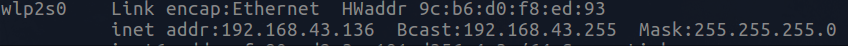
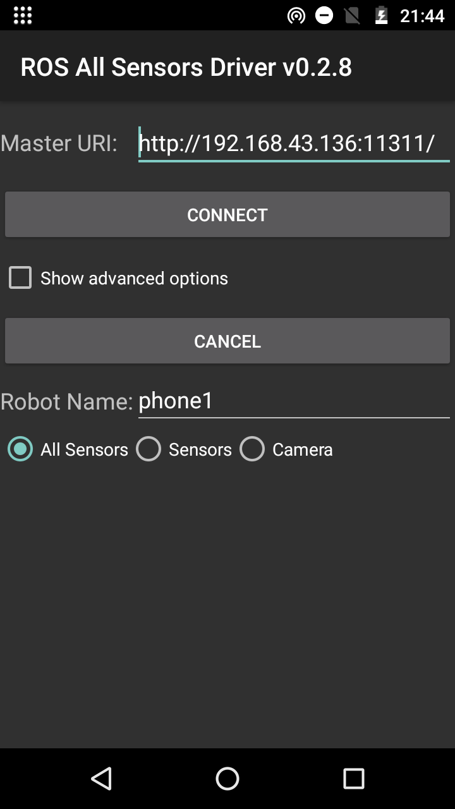
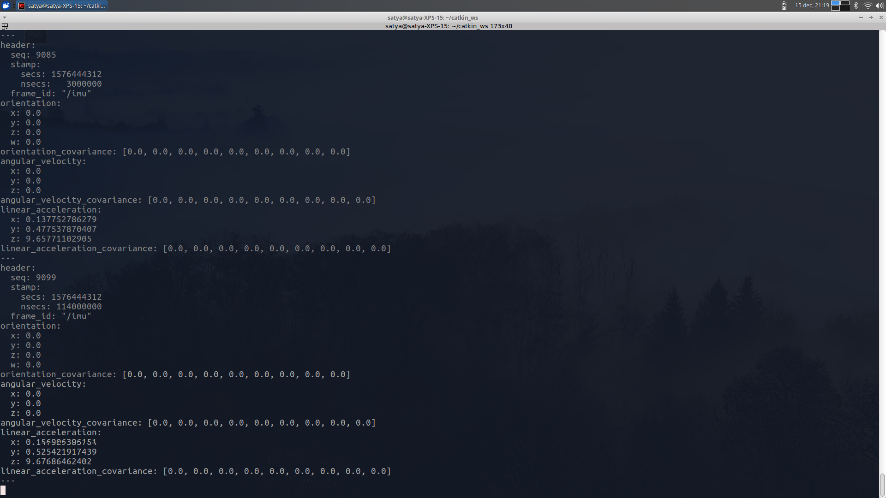
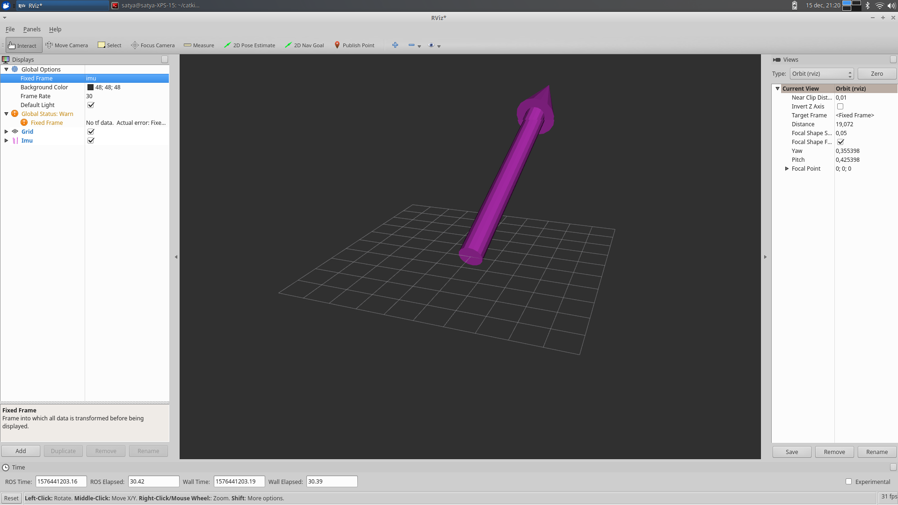
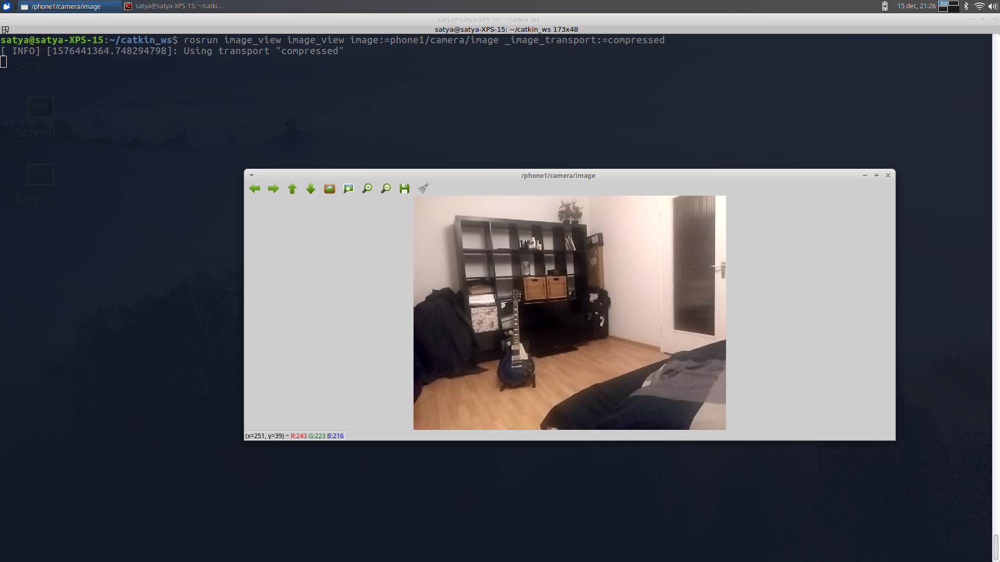

# Using your smartphone as a sensor suite for playing around in ROS

I wanted to share something I recently found to be possible and just a really cool tool to know about. Thats to make your smartphone publish its sensor data as ros nodes.

After failing twice, I finally got this thing to work, and I felt sharing this would be a lot of help to a lot of students, hobbyists and lab inhabitants out there.

To be frank, I didn't do much. But when trying to do this, I had to go through a lot of unupdated information and discouraging comments and forum posts mentioning that this doesn't work anymore. And after getting this to work after failing twice or thrice, I felt publishing this would be a value addition to any hackers out there.

## Prerequisites

1. Working [ROS](https://www.ros.org/) distribution, preferably on Linux
2. An Android smartphone 

## Tutorial

### Download the app off the app store:

1. The [ROS sensors driver](https://play.google.com/store/apps/details?id=org.ros.android.sensors_driver) allows you to use most of your sensors. \[3\]

2. The [ROS All Sensors Driver](https://play.google.com/store/apps/details?id=org.ros.android.android_all_sensors_driver) gives you the ability to use your camera in addition to other sensors. \[4\]

### Create a local hotspot from your phone

Now, here's the caveat: You want to create a local network or hotspot with your phone, rather than share your network via a router.

This is usually under the tethering/hotspot option on Android phones.

### Find your local ip address

Connect to the local hotspot, then open a terminal and find your local ip address.

This is usually found via the `ifconfig` command on Linux, and `ipconfig` command on Windows. It should usually start with 192.*

### Run the android app

Run the android app, and enter your `ip_address:ros_master_uri`.
The ros master uri (Uniform resurce identifier) can be found by the command `echo $ROS_MASTER_URI` on your computer terminal.
It's usually set to 11311 by default.

## Screenshots:

### Imu data echo

`rostopic echo /phone1/android/imu`
Data echo:

### Sensor orientation

Phone orientation visualized via Rviz

### Camera stream

To view the camera message stream, use the command:

`rosrun image_view image_view image:=phone1/camera/image _image_transport:=compressed`

## Use cases:

- Maybe you're playing around with computer vision algorithms without a working webcam or you want to have your camera moving rather than moving the objects in front of the camera, whatever floats your boat. 
    - If you need a camera, you have (I'm guessing), a pretty great one in your pocket, or lying in a drawer somewhere.

- Maybe you have an inference network running as a node, and then you can overlay your object detections on top of that.

- Maybe you're playing around with Visual SLAM, or Sensor fusion or ROS and you just need some sensor data to play with.

So, yeah, that's about it. Happy hacking.

## References:

\[1\]: Running a roscore on an Android smartphone https://wiki.epfl.ch/roscontrol/roscore-android-smartphone

\[2\]: Android sensors driver https://play.google.com/store/apps/details?id=org.ros.android.sensors_driver

\[3\]: Android all sensors driver https://play.google.com/store/apps/details?id=org.ros.android.android_all_sensors_driver
